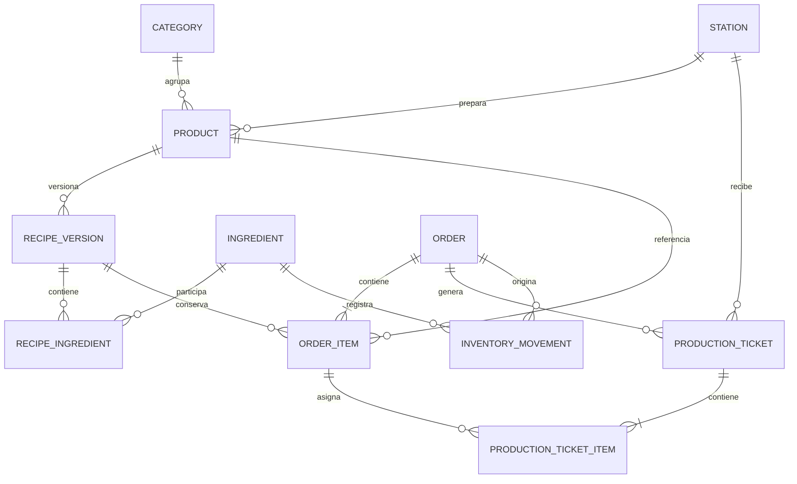

# Modelo de dominio — borrador para el piloto

Estado: preliminar; no autoriza todavía migraciones de negocio.
País confirmado por el fundador: Perú.

## Decisiones abiertas

| Decisión | Estado |
|---|---|
| Sede inicial | Una sede según el supuesto del README; identificar restaurante piloto |
| Moneda e impuestos | Pendientes; PEN solo para demostración, sin cálculo fiscal |
| Zona horaria | America/Lima propuesta y configurada localmente |
| Canal | QR, kiosco o ambos: pendiente |
| Modalidad | Mesa, recojo o para llevar: pendiente |
| Cobro y liberación a producción | Simulado, cobro al retirar o pasarela: pendiente |
| Identidad del cliente | Anónimo o cuenta: pendiente |
| Inventario | Evento de consumo, stock negativo y almacenes: pendientes |
| Costeo | Método de valorización, rendimientos y unidades: pendientes |
| Cancelación | Reversos, cortesías y reprocesos: pendientes |

## Entidades conceptuales del README

## Estados propuestos

Pedido: PENDING_PAYMENT → CONFIRMED → IN_PROGRESS → READY → DELIVERED.
Ticket: PENDING → IN_PROGRESS → READY.
Pago separado: UNPAID, PENDING, PAID, FAILED, REFUNDED.
CANCELLED requiere reglas y autorización explícitas antes de implementarse.

Un pedido solo llega a READY cuando todas las estaciones requeridas han terminado.
Confirmar conserva precio, receta y estación históricos. Repetir una solicitud
de confirmación no debe duplicar pedidos, tickets ni consumo.

## Inventario

Los movimientos confirmados no se borran; las correcciones se enlazan mediante
contramovimientos. Cantidades e importes usan Decimal. Las unidades base, reglas
de conversión, rendimientos y método de costo se decidirán antes del kardex.

El esquema definitivo incorporará roles, auditoría, pagos si aplican y ubicaciones
si se confirma más de un almacén. Se necesitan las decisiones anteriores para
establecer restricciones y transacciones verificables en PostgreSQL.
